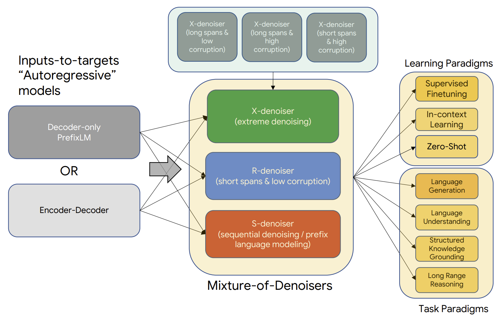
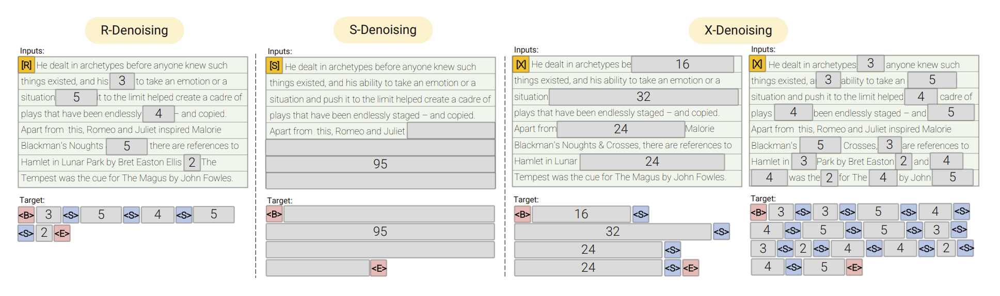
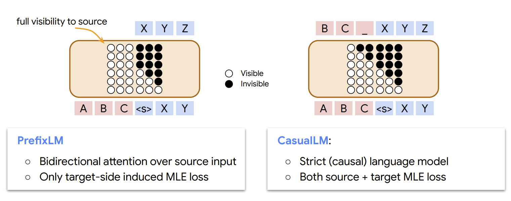

# nanoUL2

A fork of [nanoGPT](https://github.com/karpathy/nanoGPT) to enable simple training of decoder-only transformers with the [UL2 pretraining paradigm](https://arxiv.org/abs/2205.05131).



UL2 generalizes common pretraining objectives from a perspective of denoising and unifies them into a single pretraining objective by using a mixture-of-denoisers. R-denoising (regular) is the objective used in the T5 paper. S-denoising (sequential) is prefix language modeling when the end of a sequence is corrupted or regular causal language modeling when the entire sequence is corrupted. X-denoising (extreme) has a high corruption rate either from many spans or long spans of corrupted text.



This fork also takes advantage of one of PyTorch's newest features, [FlexAttention](https://pytorch.org/blog/flexattention/), in order to support PrefixLM style attention masking.


image source: [PrefixLM4MT (ICML 2022), Biao Zhang et al.](https://icml.cc/media/icml-2022/Slides/17048.pdf)

## install

```
pip install torch numpy transformers datasets tiktoken wandb tqdm
```

Dependencies:

- [pytorch (>= 2.5.0 for flex_attention)](https://pytorch.org) <3
- [numpy](https://numpy.org/install/) <3
-  `transformers` for huggingface transformers <3 (to load GPT-2 checkpoints)
-  `datasets` for huggingface datasets <3 (if you want to download + preprocess OpenWebText)
-  `tiktoken` for OpenAI's fast BPE code <3
-  `wandb` for optional logging <3
-  `tqdm` for progress bars <3

## quickstart

If you are familiar with [nanoGPT](https://github.com/karpathy/nanoGPT) then the instructions and code should look mostly the same.

To get started we can train a model on the [OpenWebText](https://huggingface.co/datasets/Skylion007/openwebtext) dataset. First, we need to download and preprocess the data by tokenizing, encoding into ints, and saving it:

```
$ python data/openwebtext/prepare.py
```

The encoded data will be saved in `train.bin` and `val.bin` in `data/openwebtext/`. 

Training on a single GPU can be kicked off by running:

```
$ python train.py config/train_openwebtext.py
```
